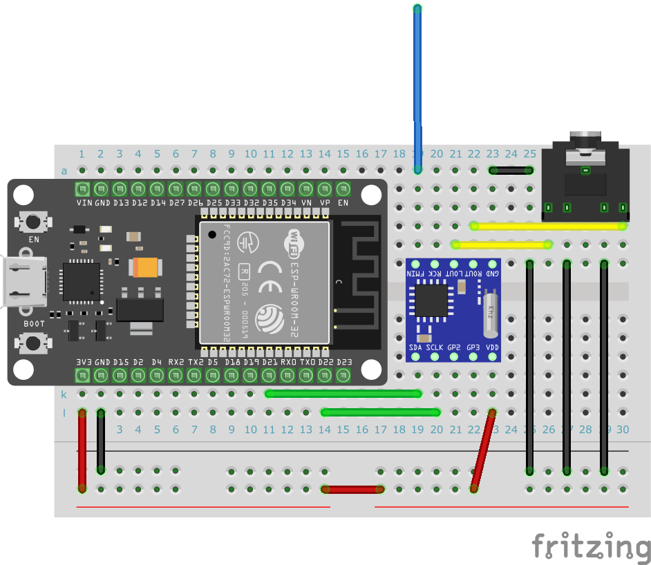

# ESP32 Radio Server

FM radio using ESP32 and RDA5807, including control panel that can be operated from a web browser.

## Wiring Diagram


## Build

Rewrite `platformio.ini` to your environment before building.

```ini
[env]
build_flags =
  -D WIFI_SSID=\"YOUR_WIFI_SSID\"
  -D WIFI_PASSWORD=\"YOUR_WIFI_PASSWORD\"
```

## Open Control Panel

Open your ESP32 IP address in your browser.


