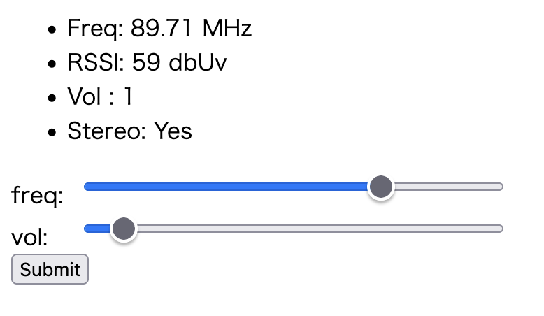

# ESP32 Radio Server

## Build

Rewrite platformio.ini to your environment.

```ini
[env]
build_flags =
  -D WIFI_SSID=\"YOUR_WIFI_SSID\"
  -D WIFI_PASSWORD=\"YOUR_WIFI_PASSWORD\"
```

## Open Control Panel

Open your ESP32 IP address in your browser.


